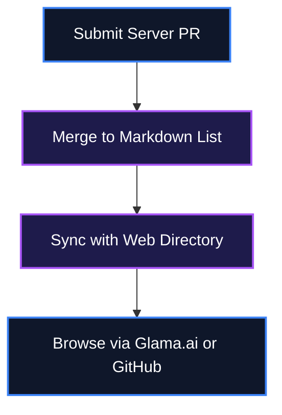

# 🚀 Awesome MCP Servers (Punkpeye) — A comprehensive directory of MCP servers

[](LICENSE)
[](#)
[](#)
[](#)

A massive, community-driven curated list of awesome Model Context Protocol (MCP) servers containing thousands of connectors and APIs across various categories, integrated with a synced web directory.

---

## 📖 Table of Contents
- [Key Features](#-key-features)
- [System Architecture](#%EF%B8%8F-system-architecture)
- [Quick Setup & Installation](#-quick-setup--installation)
- [How to Use](#-how-to-use)
- [File Structure](#-file-structure)
- [License](#-license)

---

## ✨ Key Features

- Multilingual Support: Translations available in Thai, Chinese, Japanese, Korean, Portuguese and more.
- Web Directory Sync: Integrated directly with the glama.ai/mcp/servers web-based directory.
- Iconography and Legend: Clear visual markers for official implementations, languages, local vs cloud, and OS compatibility.
- Vast Ecosystem: Covers Aggregators, Art, Design, Browser Automation, File Systems, Cloud Platforms, Coding Agents, and more.

---

## ⚙️ System Architecture

Data flow from Markdown curation to end-user browsing via GitHub or Web UI.



---

## 🚀 Quick Setup & Installation

### Prerequisites (Zero-Dependency Setup)
This guide assumes a clean machine with **no pre-installed tools**.

```cmd
winget install --id Git.Git -e --accept-source-agreements --accept-package-agreements
```

🔍 **Verification Command**:
```cmd
git --version
```
*Expected Output*: `git version 2.x.x.windows.x`

### Clone & Install
```bash
git clone https://github.com/punkpeye/awesome-mcp-servers.git
cd awesome-mcp-servers
```

### Run
```bash
cat README.md
```

---

## 🛠️ How to Use

1. Browse the extensive list of MCP servers by category in the README.
2. Refer to the legend to understand language, platform, and official status.
3. Use the provided links to install the servers and add them to your MCP configuration.

```bash
# Example command
cat README.md
```

---

## 📁 File Structure

awesome-mcp-servers-punkpeye/
├── README.md - English comprehensive list
├── README-th.md - Translated list variants
└── assets/ - Images and GIFs for demonstration

---

## 📄 License
This repository is licensed under the [MIT License](LICENSE).