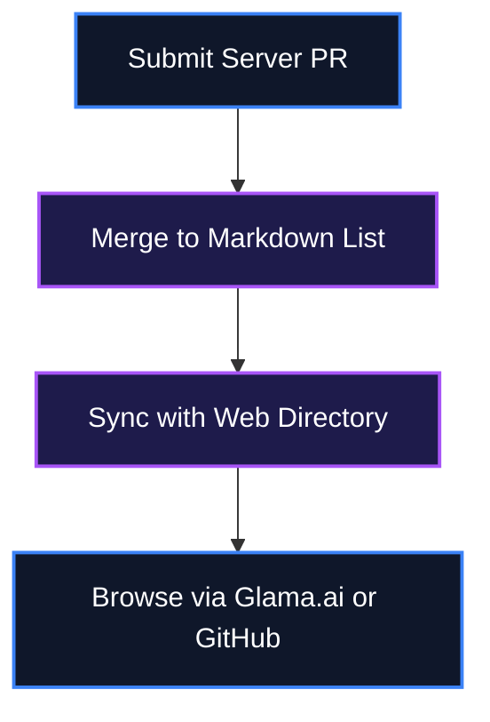

<div align="center">
  <h1>🚀 Awesome MCP Servers (Punkpeye)</h1>
  <p><strong>A comprehensive directory of Model Context Protocol (MCP) servers and APIs.</strong></p>

  [](#)
  [](LICENSE)
  [](https://github.com/punkpeye/awesome-mcp-servers/actions/workflows/ci.yml)

  <br />
  [](#)
</div>

Awesome MCP Servers (Punkpeye) is a massive, community-driven curated list of Model Context Protocol (MCP) servers. Instead of searching across the internet for individual tools, it provides thousands of connectors and APIs across various categories in one place, integrated with a synced web directory.

<br />

## 📖 Table of Contents
- [What is Awesome MCP Servers (Punkpeye)?](#-what-is-awesome-mcp-servers-punkpeye)
- [Key Features](#-key-features)
- [System Architecture](#-system-architecture)
- [Setup & Installation](#-setup--installation)
- [How to Use](#-how-to-use)
- [Scope & Limitations](#-scope--limitations)
- [File Structure](#-file-structure)
- [Contributing](#-contributing)
- [License](#-license)

---

## 💡 What is Awesome MCP Servers (Punkpeye)?

Finding, evaluating, and configuring Model Context Protocol servers can be fragmented and time-consuming. 

Instead of scouring GitHub or various web forums, Awesome MCP Servers (Punkpeye) centralizes discovery:
- **Comprehensive Index**: Covers Aggregators, Art, Design, Browser Automation, File Systems, Cloud Platforms, Coding Agents, and more.
- **Visual Clarity**: Clear visual markers (Iconography and Legend) for official implementations, languages, local vs cloud, and OS compatibility.
- **Multilingual Support**: Translations available in Thai, Chinese, Japanese, Korean, Portuguese and more.

---

## ✨ Key Features

- 🌍 **Multilingual Support**: Translations available in Thai, Chinese, Japanese, Korean, Portuguese and more.
- 🔄 **Web Directory Sync**: Integrated directly with the glama.ai/mcp/servers web-based directory.
- 🔣 **Iconography and Legend**: Clear visual markers for official implementations, languages, local vs cloud, and OS compatibility.
- 🌌 **Vast Ecosystem**: Covers Aggregators, Art, Design, Browser Automation, File Systems, Cloud Platforms, Coding Agents, and more.

---

## ⚙️ System Architecture

Data flow from Markdown curation to end-user browsing via GitHub or Web UI.



---

## 🚀 Setup & Installation

### Manual Installation

```bash
git clone https://github.com/punkpeye/awesome-mcp-servers.git
cd awesome-mcp-servers
```

🔍 **Verification Command**:
```bash
cat README.md
```
*Expected Output*: `[Displays the content of the README.md file]`

---

## 🖥️ How to Use

1. Browse the extensive list of MCP servers by category in the README.
2. Refer to the legend to understand language, platform, and official status.
3. Use the provided links to install the servers and add them to your MCP configuration.

```bash
# View the list locally
cat README.md
```

---

## 🔬 Scope & Limitations

- **Maintenance Dependency**: As a community-driven list, it relies on contributors to keep the links and statuses updated.
- **Configuration Variance**: Setup and installation vary wildly by individual MCP servers, requiring users to consult each tool's specific documentation.

---

## 📁 File Structure

```
awesome-mcp-servers/
├── README.md            - English comprehensive list
├── README-th.md         - Translated list variants
├── CONTRIBUTING.md      - Contribution guidelines
├── LICENSE              - MIT License
└── assets/              - Images and GIFs for demonstration
```

---

## 🧩 Contributing

To add a new MCP server or update an existing one, please fork the repository and submit a Pull Request. Refer to the CONTRIBUTING.md file for the complete format guidelines.

---

## 📄 License
MIT License © 2026 punkpeye(https://github.com/punkpeye)

<div align="center">

If Awesome MCP Servers (Punkpeye) helped you discover useful tools, a ⭐ helps other people find it.

</div>